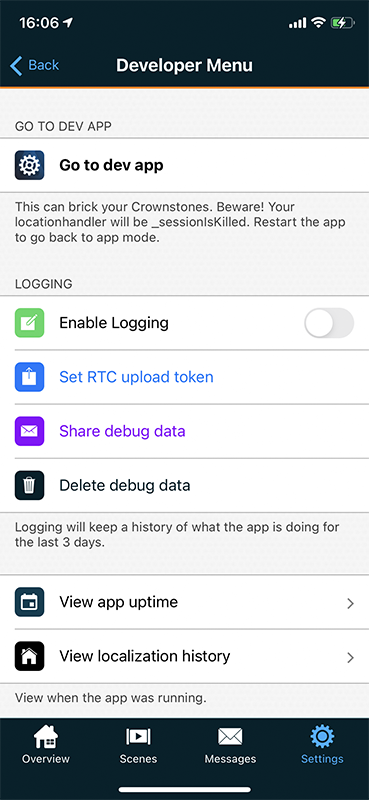
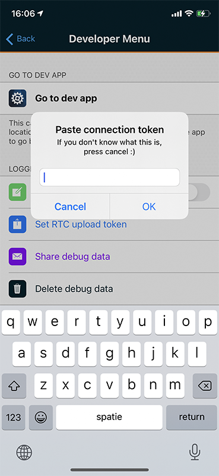
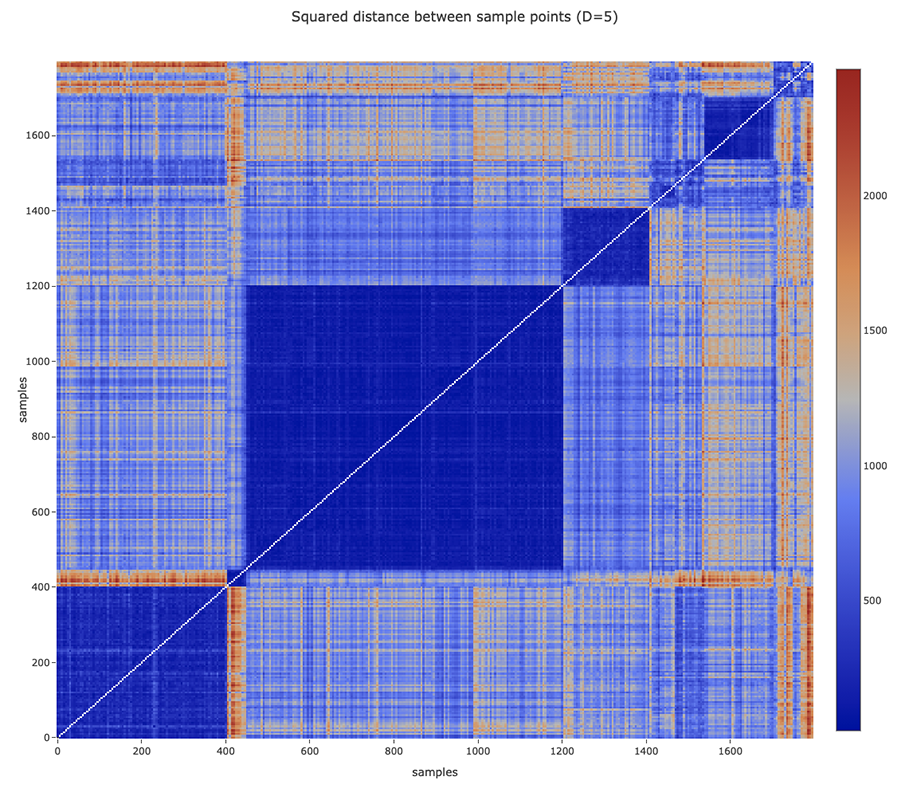
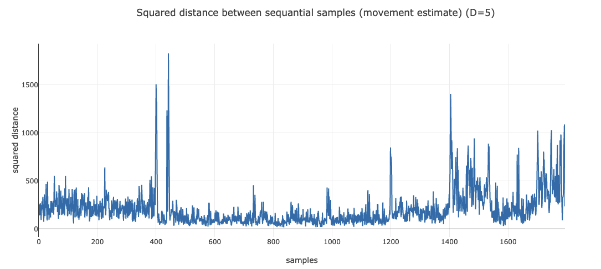
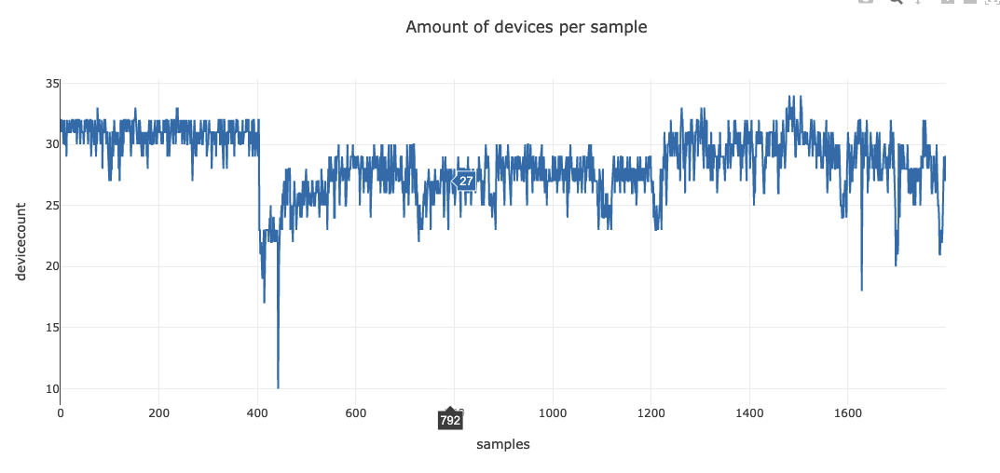
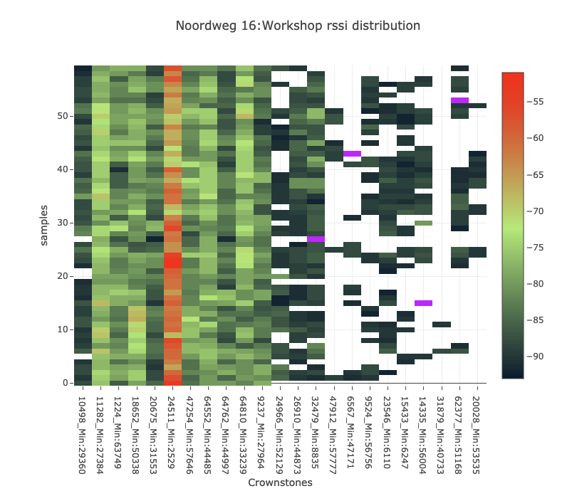
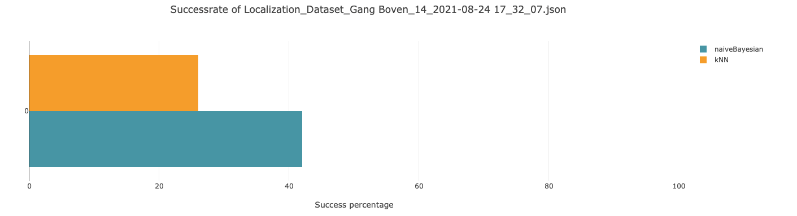
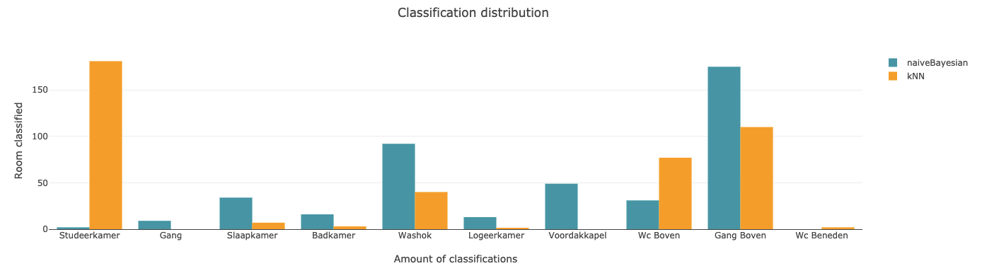
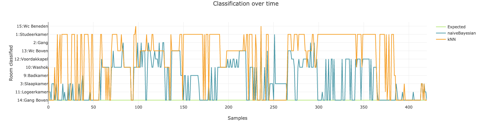
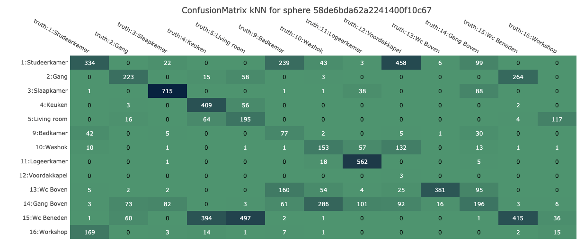

# Localization improvement 

### [Design doc can be found here](https://docs.google.com/document/d/1aLYu20I6o8gG_1yTD9qqGQF87zCzSf1p99ln56rERN4/edit#heading=h.progptq5frzj)


The focus of this project is to improve the indoor localization of the smartphone centric setup. This could eventually be generalized to any centralized localization system, where one entity knows all the RSSI values to a certain trackable.


# Concepts

The phone will collect datasets and send them to the user of this framework. This can be done via webRTC or via email or any other sharing method supported by your phone.


## WebRTC

Magically send your datasets to me! This does not work out of the box. You need a upload token, which you can request from the person running this framework.
If you have the upload token, copy it on your phone, go to the dev menu and paste it in the prompt you get by clicking on
"Set RTC upload token".



If you have that set up, you can send the datasets via the share debug data button or via the menu you get when collecting data.

## Folder structure

Data is stored in this repository. [More information on the folder structure here](./datasets/README/md).

# System hierarchy

To navigate through the datasets and to run the experiments, there are a number of classes to help you with this.
I'll go over them one by one.

```
Collective
 - TestCase[]
 - OutputDataAggregator
 
UserData
 - Scenario[]
    - TestCase[]
    
TestCase
  - Fingerprint
  - Dataset[]
  - OutputDataAggregator
  - OutputData map
```


### UserData
This is a class containing the User's scenario's

### Scenario
This is a combination of fingerprint(s) and datasets that belong together. This can be something like "Home", or "Office". This is set to homeV1 by default. There is an activeScenario.json config file in each user's folder
to indicate where new sets should go.

These are versioned in case you move Crownstones around. Once Crownstones move around the datasets should be kept separate.

A scenario has a number of testCases.

### TestCase

A testCase is a combination of 1 fingerprint file, and many datasets that can be used together with that fingerprint. (A fingerprint file contains multiple spheres and multiple rooms per sphere.)

The testcases are just in-memory relations of the files you have on disk. 

You can either get the TestCases from the UserData->Scenario[]->TestCase[], or you can construct your own.

### Collective

A collective is a set of testcases. This set can be combined to draw a confusion matrix of all experiments that were run inside the collective.

The collective class has a set of methods to quickly get the testcases from disk, like loadAllUsers, load specific user, manually add testcase.

# Container classes


### Dataset
This represents a data file on disk and has util methods like mapping from app data to lib data, writing tmp files, etc.
It also contains a number of analysis plot methods. 
- It can plot a DistanceMap of the points in the set to indicate if there are many similar points in a dataset. (D=5 means that we skip 4 samples when comparing. This lowers the resolution of the graph but keeps it performant).
  In the image below we see:
  - the phone was static for 400 samples
  - was moved to a new location
  - was static again untill sample 1200
  - moved to a third location until 1400
  - moved around a bit
  - settled on a location for 1500-1700 
  - at the end the user was sending the set, likely resulting in the last difference.
       
- It can plot an DistanceGraph which shows the distance between sequential datapoints. This indicates how much movement there was while collecting the dataset. (D=5 means that sample[0] is compared with sample[5])
    The graph shows the movement peaks we distilled from the map above.
  
- It can plot an SampleSizeGraph which shows the how many Crownstones are in each sample. Not every Crownstone is in every input vector due to either timing, bad luck or signal blockage by the real world and the user.
   
- It can plot a RSSI distribution where you can see per vector which Crownstones are in it and what their RSSI values are. Pink is lowest value.
   


### Fingerprint
This represents a fingerprint file on disk and has util methods like mapping from app data to lib data, writing tmp files, etc.
The Fingerprint can also plot a summary of it's items. A fingerprint can be converted into an array of Datasets. A fingerprint has methods to get a LocationNameMap and a SphereNameMap, which allows you to 
match the ids in the classifier results to names of the sphere/locations. This data is obtained from the metadata of the app data files.

### Fingerprint builder
This class can be used to construct your own fingerprints by loading random samples of datasets or different fingerprints into it. This can be used for sensitivity analysis of classifiers against multiple generated fingerprints.

### OutputData
The output data is a dataset that is outputted by one of the classifiers. It has naiveBayesian and kNN data. It has a link to it's fingerprint and dataset that were used to construct it.
The output data has a number of visualization options:
- SuccessRate
  - A bar graph showing the success percentage per classifier.
    
- LocalizationBarGraph
  - A bar graph showing the distribution of the classifications.
    
- ClassificationGraph
  - A line graph showing the classified room for each sample for each classifier.
    


### OutputDataAggeragator
This class can combine any number of Output Data classes, as well as merge with other OutputDataAggragators. Each TestCase has one Aggregator, which automatically aggregates on a runAll call.
A Collective also has one OutputDataAggregator, which merges with all the ones in the contained testCases.
- it can plot a confusion map per sphere. Each sphere with samples will be plotted in a new window. Spheres and locations are obtained from the fingerprints in the testSets.
   


# Util and Tooling

There are a number of util classes that abstract a lot of the conversion and disk operations.

### FileUtil

This does everything with the filesystem. It reads dirs, loads files into container classes, stores files, removes files etc. It has a number of higher level methods like:
- getUsers
  - Get all users on disk as an UserData[]
- getFingerprints
  - Get all fingerprints on disk as a Fingerprint[]
- getDatasets
  - Get all datasets on disk as a Dataset[]

### DataMappers

These map app data to lib data.

### Util

Small helper functions.


# Runners

Runners are function that call the bridge files for iOS, android, and a combination. Each bridge file gets the following 3 command line arguments:
- fingerprintPath
  - This is a tmp file created by the Fingerprint class. This class maps the app data format to the lib format and writes it to the tmp file location.
- datasetPath
  - This is a tmp file created by the Dataset class. This class maps the app data format to the lib format and writes it to the tmp file location.
- outputPath
  - This is where the bridge file will write it's output so that Node can read it back and process it.


# RTC
This is the code that runs the server, takes care of the file transfer and writes the files to disk.
Each time the localization datasets are sent, the fingerprints on the phone are also sent. The RTC code checks if the fingerprint is different from the one already available on disk and only writes it 
to the dataset folder once it is new. This is per user, per scenario.

Scenario data is not contained in the RTC traffic and has to be taken care of my the receiver. This is done by changing the activeScenario.json.


# Weka

To use auto-weka, you have to checkout the following repo
```
git clone https://github.com/automl/autoweka
```

If you don't clone it into this repo, you have to update the config to point to the autoweka jar file.

# T-SNE

There have been experiments with T-SNE and the code works and makes plots.
We have found that this is not useable for classification so has not been further integrated.

Code and examples are in the experiments/plotting folder.